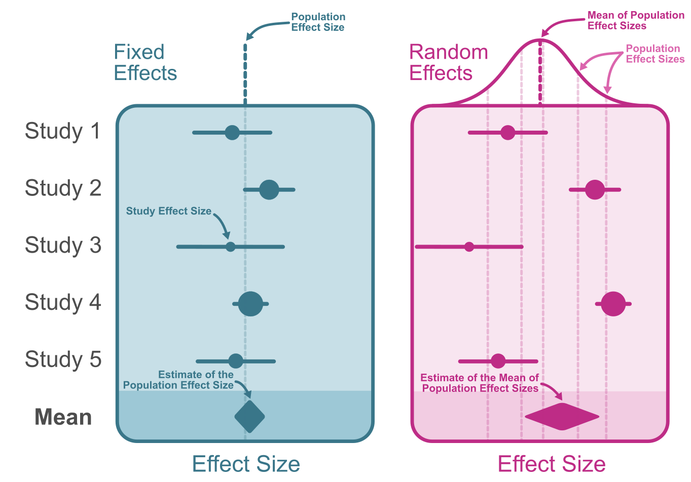

## Why do a Meta-Analysis?

- **Precision**: Many studies are too small to be convincing alone. Pooling many studies increases statistical power to detect effects.
- **Answer broader questions**: Combining diverse studies tests consistency of the effect across populations and interventions.
- **Resolve conflicting evidence**: Meta-analysis allows us to resolve conflicts found in studies with opposite effects.

# GRADE Framework

To make conclusions about a phenomenon after conducting a systematic review, we need to provide estimates of certainty in the evidence. To do this, we follow the [GRADE](https://book.gradepro.org/guideline/overview-of-the-grade-approach#certainty-of-the-evidence-about-the-effect-of-interventions/five-domains-can-lower-the-certainty-of-the-evidence-from-rcts-and-nrsi) (Grading of Recommendations Assessment, Development and Evaluation) guidelines.

GRADE is

> "a well-developed formal process to rate the quality of scientific evidence in systematic reviews and to develop recommendations in guidelines that are as evidence-based as possible" 

Use **GRADE** to evaluate evidence based on:

1. Imprecision
- Are the confidence intervals wide or overlapping null effects?

2. Inconsistency
- Examine heterogeneity (e.g., τ²) 
- Are the results consistent across populations and settings?

3. Publication Bias
- Create funnel plots or fit a p/z-curve
- Is there indication of selective reporting/publishing barely significant results?

4. Risk of Bias
- Assess the individual study quality.
- Do high risk studies bias the effect estimate?

5. Indirectness
- Are the populations, interventions, and comparators in these studies directly applicable to your research question?


This document provides information for addressing *imprecision*, *inconsistency*, and *risk of bias* and *publication bias*. The code provided demonstrates how to conduct the synthesis in an open and reproducible way. Risk of bias assessment and indirectness are not covered in depth.

# 1. Imprecision {#sec-imprecision}
## Choosing and Estimating Effect Size

> Effect size: *“A quantitative reflection of the magnitude of some phenomenon that is used for the purpose of addressing a question of interest”* [(Kelley & Preacher, 2012)](https://psycnet.apa.org/doi/10.1037/a0028086)

There are many effect size types, and they usually depend on the type of data collected, along with the chosen analysis. For example, if we're interested in height difference between men and women, we can calculate a mean difference (effect size) of their height in cm (continuous data).

### Types of data

- Dichotomous: binary responses with only two outcomes (yes/no, e.g., has a person stopped smoking after an intervention)
- Continuous: data measured on a continuous scale with any possible value within a defined range (e.g., weight after a weight loss intervention)
- Ordinal: categorical data measured on a scale with predefined sets of possible values, set in a particular order (e.g., answers on a Likert scale)
- Count/rate: data representing the number of times an event occurs (count), or how many times it occurs within a certain period (rate) (e.g., number of correctly read words per trial)
- Time-to-event: time it takes until an event occurs 

### Effect size types

- **Dichotomous**: Odds ratio (OR), Risk ratio (RR), Risk difference (RD)
- **Continuous**: Mean difference (MD), Standardized mean difference (SMD)
- **Other**: Correlation coefficients, non-overlap measures

### Example 1: Dichotomous Data
Let's compare the number of hard-of-hearing participants diagnosed with depression between the group that received hearing aids and the group that has not.

|                  | Depression   | No Depression    | N   |
| ---------------- | ------------ | ---------------- | --- |
| Hearing aids     | 12           | 88               | 100 |
| No hearing aids  | 34           | 66               | 100 |

To get an effect size that will represent the strength of intervention's effectiveness, we can calculate an odds ratio, i.e., proportion of depressed compared to not depressed individuals between the hearing aids and no hearing aids groups. The code chunk below shows one of many ways to calculate odds ratio in R. Then we print a table with results.

#### R code to compute odds ratio 
```{r}
#| code-fold: true
#| lst-label: odds-ratio
#| lst-cap: OR

options(scipen = 999)
table <- matrix(c(12, 88, 34, 66), nrow = 2, byrow = TRUE)
colnames(table) <- c("Depressed", "Not_Depressed")
rownames(table) <- c("Hearing_aids", "No_Hearing_aids")
kableExtra::kable(table)

# install.packages("epitools")
library(epitools)
result <- oddsratio(table)
kableExtra::kable(result$measure) #prints a nicely formatted table
```

We see in the table that the odds of being diagnosed with depression is `r round((1 - result$measure[2,1])*100)`% lower when the individual received hearing aids. The 95% confidence interval ranges from `r round((1 - result$measure[2,2])*100)`% lower to `r round((1 - result$measure[2,3])*100)`% lower, so the risk is significantly lower for the hearing aids group. Note that odds ratio of 1 signifies no difference between the groups.

### Example 2: Continuous Data

Here is another example of an effect size, this time for continuous data. We can compare the mean outcome scores (i.e., reading comprehension scores) between the children with intellectual disability that received a working memory training intervention and children with ID that did not receive any intervention.

|                 | Mean | SD  | N  |
| --------------- | ---- | --- | -- |
| WM training     | 5.2  | 1.1 | 50 |
| No intervention | 4.5  | 1.3 | 45 |

To get an effect size that represents the strength of the intervention’s effectiveness, we can calculate the mean difference between the groups (MD). However, calculating just a mean difference by subtracting one mean from the other only makes sense when we want to meta-analyse studies that have used the exact same measurement scales/tools. Then their measurement units are completely comparable and mean differences give us an interpretable estimate. In reality, this is unlikely. Studies will use different scales, and adapt their measures to the design. To make the estimates standardized and comparable across studies, the standardized mean difference (SMD) is calculated instead, by standardizing the mean difference by the pooled standard deviation (or other variants). There are different SMDs, most common one being Cohen's d, but the one that provides a less biased estimate, particularly in studies with small sample sizes, is Hedges' g.

The code chunk below shows one of many ways to calculate SMD (Hedges' g) in R.

#### R code to compute MD and SMD
```{r}
#| code-fold: true
#| lst-label: smd
#| lst-cap: SMD

# Example data
group1 <- c(mean = 5.2, sd = 1.1, n = 50) #WM group
group2 <- c(mean = 4.5, sd = 1.3, n = 45) #control group

# install.packages("esc")
library(esc)
ef <- esc_mean_sd(grp1m = group1["mean"], grp1sd = group1["sd"], grp1n = group1["n"],
            grp2m = group2["mean"], grp2sd = group2["sd"], grp2n = group2["n"], es.type = "g")
```

We see in the output that the effect of WM training on reading comprehension scores is `r round(ef[['es']],2)`. The standardized mean difference (Hedges’ g) adjusts for the different standard deviations and gives an effect size on a common scale, presented as the increase in the standard deviations. In this case, it means that the group that received the intervention scored 0.58 standard deviations higher than the control group.

There are many more ways to calculate a common effect size for all studies, and this [book](https://matthewbjane.quarto.pub/guide-to-effect-sizes-and-confidence-intervals/) provides ways to use different types of test statistics and data information to convert to common effect sizes, along with detailed explanation for each effect size.

# Meta-Analysis Procedure

Now that we know how to calculate effect sizes for all included studies, we can run the meta-analysis.
To conduct a meta-analysis, the following steps are:

1. Compute effect size for each study.
2. Combine using weights. Weighting usually is needed because not all studies are equal in their statistical power and quality. The most common way to add weight to studies is by multiplying each estimate with the *inversed variance (1/v)* (for random-effects 1/(v + τ²)) and computing weighted means. 

The weighted mean effect size $\hat{\mu}$ is calculated as:

$$
\hat{\mu} =
\frac{\sum_{i=1}^k w_i \cdot ES_i}{\sum_{i=1}^k w_i}
$$

where:  
- $ES_i$ = effect size of study $i$  
- $w_i = \frac{1}{v_i}$ = weight of study $i$, with $v_i$ being its variance (or $v_i$ + $tau^2$ for random-effects meta-analysis)  
- $k$ = number of studies

Because the inverse variance is proportional to the sample size, this simply gives more weight to studies with larger sample size, making the estimated population effects closer to the effects found in larger studies. There are other ways to assign weight as well, e.g., by giving more relevance to studies with low risk of bias assessment. 

# Example Dataset

We will use an example dataset to go through all domains and evaluate the evidence strength at the end. This is a mock dataset contains results from 10 studies comparing the effectiveness of **neurofeedback pocedure** to **no treatment** for reducing ADHD symptoms in young people. The dataset contains study labels needed to differentiate effects from different studies, the effect size, standard error, *p*-value (needed to conduct the z-curve analysis in the publication bias section), information about the population, intervention, comparison. We also have information about the risk of bias level of each conducted study and some notes. 

To conduct the meta-analysis, we need the columns with the study label, effect size and standard errors.

```{r}
#| code-fold: true
#| lst-label: dataset
#| lst-cap: data

library(tibble)
dataset <- tribble(
  ~Study, ~Effect_Size, ~SE, ~P_value, ~Population, ~Intervention, ~Control, ~Risk_of_Bias, ~Notes, ~Sample_Size,
  "Smith et al.", 0.25, 0.10, 0.012, "Children", "NFP", "Placebo", "Low", "—", 80,
  "Lee et al.", 0.40, 0.15, 0.008, "Children", "NFP", "Waitlist", "High", "Small sample", 45,
  "Wang et al.", 0.10, 0.20, 0.003, "Adolescents", "NFP", "Placebo", "Moderate", "Different setting", 60,
  "Patel et al.", 0.35, 0.12, 0.005, "Children", "NFP", "Waitlist", "Low", "—", 95,
  "Garcia et al.", 0.05, 0.18, 0.780, "Adolescents", "NFP", "Placebo", "High", "High attrition", 50,
  "Kim et al.", 0.30, 0.11, 0.015, "Adolescents", "NFP", "Placebo", "Moderate", "—", 85,
  "Nguyen et al.", 0.45, 0.14, 0.002, "Children", "NFP", "Waitlist", "Low", "—", 110,
  "Jones et al.", 0.20, 0.17, 0.240, "Children", "NFP", "Placebo", "High", "Different dosage", 70,
  "Olsen et al.", 0.15, 0.19, 0.410, "Children", "NFP", "Placebo", "Moderate", "—", 65,
  "Choi et al.", 0.50, 0.13, 0.001, "Children", "NFP", "Placebo", "Low", "—", 120,
  "Nilsson et al.", 0.52, 0.14, 0.001, "Adolescents", "NFP", "Placebo", "Low", "—", 100,
  "Olson et al.", 0.15, 0.19, 0.410, "Adolescents", "NFP", "Placebo", "Moderate", "—", 75,
  "Cho et al.", 0.50, 0.13, 0.01, "Children", "NFP", "Placebo", "Low", "—", 130,
  "Nilssone et al.", 0.52, 0.14, 0.005, "Adolescents", "NFP", "Placebo", "Moderate", "—", 90,
  "Martinez et al.", 0.33, 0.16, 0.020, "Children", "NFP", "Waitlist", "Moderate", "Urban setting", 82,
  "Brown et al.", 0.27, 0.12, 0.030, "Adolescents", "NFP", "Placebo", "Low", "—", 105,
  "Kumar et al.", 0.18, 0.17, 0.220, "Children", "NFP", "Placebo", "High", "Short follow-up", 48,
  "Andersson et al.", 0.48, 0.11, 0.004, "Adolescents", "NFP", "Waitlist", "Low", "Large sample", 150,
  "Lopez et al.", 0.21, 0.15, 0.080, "Children", "NFP", "Placebo", "Moderate", "—", 88,
  "Stevens et al.", 0.42, 0.13, 0.006, "Children", "NFP", "Waitlist", "Low", "—", 140,
  "Huang et al.", 0.36, 0.14, 0.010, "Adolescents", "NFP", "Placebo", "Moderate", "—", 115,
  "Baker et al.", 0.09, 0.18, 0.520, "Children", "NFP", "Placebo", "High", "Underpowered", 40,
  "Sato et al.", 0.55, 0.12, 0.0008, "Adolescents", "NFP", "Waitlist", "Low", "—", 160,
  "Dubois et al.", 0.29, 0.15, 0.040, "Children", "NFP", "Placebo", "Moderate", "—", 92
)

kableExtra::kable(dataset)

```

To meta-analyse the effects, we use a form of a regression model. We consider each effect size a data point with known sampling variance, which we then use to fit a regression model (i.e., estimate the population effect), with the additional nesting that happens within studies. This clustering makes meta-analysis a multilevel regression, with the first level being the study effect size, the second level being the (average) population effect estimated from the studies. There can be more levels, e.g., if you have access to individual participant data, or if there are multiple measures per study.

In these models, we also want to estimate the overall heterogeneity (variance) of the population effect (i.e., find out how much the effects vary among studies due to differences in design or populations sampled for the study). There are multiple ways to estimate this variance, and the default provided by the `metafor` package in R is the restricted maximum likelihood estimator (REML) variance estimator, as it was found to be the least biased [Langan et al., 2018](https://doi.org/10.1002/jrsm.1316).

For the models, we can assume either:

- **Equal-effect**: Assumes one true effect. This will in the literature sometimes be referred to as "fixed effects", which is a misnomer (cf. [Viechtbauer](https://wviechtb.github.io/metafor/reference/misc-models.html)). Equal effect models provides with a precise estimate of a true population effect; or
- **Random-effects**: Allows the true effect to vary across studies, which are random samples from independent distributions of different true effects. Random-effect meta-analysis models provide us with an *average true effect*.

Take a look at this figure created by [Matthew B. Jane](https://matthewbjane.github.io/):



### R code for meta-analysis
```{r}
#| code-fold: true
#| lst-label: lst-meta-analysis
#| lst-cap: meta-analysis

# install.packages("metafor") if needed
library(tidyverse)
library(metafor)

# your data
studies <- dataset %>% transmute(
  study = Study,
  yi = Effect_Size,  # effect sizes
  sei = SE   # standard errors
)

# run a random-effects meta-analysis
m <- rma(yi = yi, # add all efect sizes
         sei = sei, # add their standard errors
         data = studies, method = "REML")  # or method = "DL" for DerSimonian-Laird

pi <- predict(m, digits=3)
# print results
summary(m)

```

In the summary we see the model estimates, variance (τ²) and other information about the meta-analytic model. The average population effect of NFP compared to control conditions is g = `r round(m[['b']],2)`, 95%CI [`r round(m[['ci.lb']],2)`, `r round(m[['ci.ub']],2)`], with a variance of τ² = `r round(m[['tau2']],5)`. The effect is of moderate size. Low variance and narrow confidence interval can be interpreted as a more precise estimate of the population effect, according to the GRADE guidelines for *imprecision*.

Although less common, along confidence intervals, it is good to report [*prediction intervals*](https://doi-org.e.bibl.liu.se/10.1136/bmjopen-2015-010247). A 95% prediction interval estimates where the true effect is supposed to be in 95% of similar future studies. The prediction interval provides a wider range of possible values if there is heterogeneity between the studies and is thus more informative than confidence intervals.

In this meta-analysis, the 95% prediction interval is PI [`r round(pi[['pi.lb']],2)`,`r round(pi[['pi.ub']],2)`], which is the same as the confidence interval, because there is no heterogeneity in this dataset. This means that we can expect the true effect will be between g = 0.29 and g = 0.4 with 95% probability.

*Always report uncertainty (e.g., confidence intervals or standard errors) along with the estimates.*

We can visualize the dataset with a forest plot, which plots effect sizes of the inidividual studies as point estimates, and confidencve intervals as error bars. Together with study labels this allows us to have a better overview of the effect sizes, imprecision (presented as confidence interval bars) and the overall effect estimate from the meta-analysis. The tabs present a default forest plot created by 'metafor' and a simple 'ggplot' version that lets you modify the appearance in various ways.

```{r}
#| code-fold: true
#| lst-label: lst-forest-plot
#| lst-cap: forest plot

# recreate the plot in ggplot for nicer appearance
ma_d <- data.frame(
  yi = m[["b"]],       # effect size taken from the ma model
  sei = m[["se"]],      # standard error taken from the ma model
  study = "RE Model",     # naming the model in the study label
  lower_ci = m[["ci.lb"]], #95% lower Confidence Interval
  upper_ci = m[["ci.ub"]] #95% upper CI
)

studies_gg <- bind_rows(studies, ma_d) 

studies_gg <- studies_gg %>% 
  mutate(lower_ci = yi - 1.96 * sei, #calculate the lower CI
  upper_ci = yi + 1.96 * sei #calculate the upper CI
  )


### ggplot forestplot
studies_gg$desired_order <- seq(dim(studies_gg)[1],1)
gg_forest <- ggplot(studies_gg, aes(y = reorder(study, desired_order))) +
    geom_point(aes(x=yi), size = 3, shape=15, color = "darkred") +  
    geom_errorbarh(aes(xmin = lower_ci, xmax = upper_ci), height = 0.2, color = "grey") +  
    labs(
      x = "Effect Size (Hedges' g)",
      y = "Study",
      caption = "Error bars represent 95% confidence intervals"
    ) + theme_minimal() + coord_cartesian(xlim = c(min(studies_gg$lower_ci), max(studies_gg$upper_ci)), ylim = c(0,dim(studies_gg)[1] + 1))
```

::: {.panel-tabset}

## metafor

```{r}
#| echo: false
# forest plot
forest(m)
```

## ggplot

```{r}
#| echo: false
gg_forest
```
:::

# 2. Inconsistency
Along with imprecision, according to the GRADE framework, we have to evaluate how inconsistent the effects are between the studies, to evaluate robustness and generalizability of the effect. To do this, we estimate the variance (or better yet the standard deviation of the estimated population effect), along with other information about the heterogeneity.

## Heterogeneity
Here are the explanations for the most commonly used estimates of heterogeneity, ordered by their informativeness: 

- **τ² (Tau²)**: Between-study variance. Variance tells us how large the heterogeneity of true effects is.
- **I²**: % of variation due to heterogeneity. This tells us whether the variation comes more from random sampling errors, or systematic differences of the effects (e.g., due to actual differences in populations, measures or exposure characteristics).
- **χ² test**: Test of heterogeneity. This test only tells us whether there is significant heterogeneity, but nothing about its size.

Interpretation of I²:

| I² (%) | Interpretation |
| ------ | -------------- |
| 0–40   | Low            |
| 30–60  | Moderate       |
| 50–90  | Substantial    |
| 75–100 | Considerable   |

According to this, in the analysis conducted in the @sec-imprecision section, we found low heterogeneity, i.e., variance (τ²) = `r round(m[['tau2']],7)`. From variance, we can also look at the standard deviation of the distribution of the effects, i.e., τ = `r round(sqrt(m[['tau2']]),4)`), which is a more easily interpretable value than variance. 
I² is also low (`r round(m[['I2']],2)`%), i.e., the heterogeneity due to differences between populations or study designs is low, which means the effect is robust across populations.

Along heterogeneity, to evaluate the robustness of the effect, we should conduct a sensitivity analysis to find any studies that potentially drive the effect estimate up or down. Generally, a meta-analysis can be accompanied by a sensitivity analysis called "leave-one-out" analysis. This approach involves conducting the meta-analysis k number of times, each time excluding a different study, until each study in the set has been excluded once. Consequently, this allows us to identify which studies (if any) largely influence the average effect size estimate and whether such bias skews the outcomes of the meta-analysis.

### R code to assess heterogeneity and sensitivity

```{r}
#| code-fold: true
summary(m)
```

Leave-one-out analysis
```{r}
#| code-fold: true
#| class-output: scroll-output
#| lst-label: lst-leave-one-out
#| lst-cap: leave-one-out code
leom <- leave1out(m)

leom %>% as.data.frame() %>% kableExtra::kable()
```

The leave-one-out analysis output provides a table with an effect size estimate for a model with each study excluded. Comparing them just visually, we can see that the effect size estimate stays relatively similar each time, with a slightly larger estimate found when the first study is excluded, but not meaningfully different. Therefore, we can conclude that the estimate is robust and that no studies biased the estimate.

# 3. Risk of bias
When we have results of the risk of bias assessment for each study, we can conduct subgroup or moderator analyses that will allow us to evaluate whether high-risk studies influence the effect estimate.

Code below shows how to conduct a subgroup analysis based on risk of bias assessment in R, based on code provided by [Viechtbauer](https://www.metafor-project.org/doku.php/tips:comp_two_independent_estimates).

```{r}
#| lst-label: lst-rob-analysis
#| lst-cap: RoB analysis code
#| code-fold: true

library(metafor)
res1 <- rma(Effect_Size, SE, data=dataset, subset=Risk_of_Bias=="High")
res2 <- rma(Effect_Size, SE, data=dataset, subset=Risk_of_Bias=="Moderate")
res3 <- rma(Effect_Size, SE, data=dataset, subset=Risk_of_Bias=="Low")

dat.comp <- data.frame(Risk_of_Bias  = c("High", "Moderate", "Low"), 
                       estimate = c(coef(res1), coef(res2), coef(res3)), 
                       stderror = c(se(res1), se(res2), se(res3)),
                       tau2     = c(res1$tau2, res2$tau2, res3$tau2))
dfround(dat.comp, 3)

rma(estimate, sei=stderror, mods = ~ Risk_of_Bias, method="FE", data=dat.comp, digits=3)

```

We see that the low risk studies produce the largest effect size estimate, but none of the categories significantly drive the estimate to one direction. In this case, you can decide to keep all studies in your meta-analysis, but you can also decide to exclude high risk studies from your meta-analysis for a more reliable estimate of the effect. 

# 4. Publication (Reporting) Bias

Now that we have information about *imprecision*, *risk of bias*, and *inconsistency*, we can look at the *reporting bias* to finalize the assessment of certainty in evidence according to GRADE.

Publication bias is bias in effect size estimates which arises due to publication system practices. Conventionally, positive findings (i.e., statistically significant findings) are considered more important and interesting, and therefore are more likely to be published. This in turn leads to (questionable research) practices which inflate the values and artifically lead to low *p*-values (which are often right at the threshold of significance). These practices skew the perception of the effectiveness of interventions, as they might appear significant according to the published research, but the (average) true population effect in reality is not strong or might not be meaningful at all.

One way to combat this is to include unpublished, gray literature in the systematic review to ensure file-drawer, non-significant findings are also represented in the data. However, there are tools that allow us to statistically evaluate the published findings to identify potential publication bias.

There are multiple popular and less popular ways to analyse it:

- **Funnel plots**: commonly presented in meta-analyses. Funnel plots allow us to visualize each study as a point in an inverse funnel, where the x-axis represents the effect size, and the y-axis represents the precision, with the standard error often being used as the measure of precision. The funnel has a vertical line which represents the average effect size of the dataset (although the reference line is often also set to the line of no effect, e.g., 0), and the triangle lines on both sides which represents the 95% confidence interval. 

  Study points lying right on the lines of the triangle are exactly at the significance threshold (on the 95% confidence interval line). A funnel plot which has study points scattered symmetrically on both sides of the average effect size vertical, and scattered within the triangle, usually indicates that there is no publication bias and all effect sizes sampled from the distribution are equally likely published. If the studies cluster around the threshold of significance line, that indicates potential publication bias. Note that funnel plots also carry their own biases, and are not reliable with fewer than 10 studies, so they should be interpreted along other indicators if possible, or interpreted with caution.

  Additionally, placement on the axes tells us about the precision of the effect and its size. Study points that are more to the right of the x-axis and at the top of the y-axis have larger effects with smaller standard errors, which makes them more precise. Funnel plot interpretation is contingent on sample size and heterogeneity of effects, thus not all assymmetries will indicate publication bias, but rather other issues like heterogeneity or other artefacts. Sterne et al. [(2011)](https://doi.org/10.1136/bmj.d4002) provide recommendations for interpreting funnel plots.

- **Egger’s test**: Egger's test is another commonly conducted test for publication bias, although it should be interpreted together with the funnel plot. Egger's test assesses the symmetry of the funnel plot to infer whether there's publication bias based on statistically significant results.

- Newer, less commonly used methods include the p-curve [(Simonhson et al., 2014)](https://psycnet.apa.org/doi/10.1037/a0033242) which estimates the publication bias by plotting significant values to see whether the distribution is closer to the true effect or accumulates around the significance threshold (i.e., indicates selective reporting), and the z-curve [(Schimmack & Bartoš, 2023)](https://doi.org/10.1371/journal.pone.0290084) which allows us to estimates publication bias by assessing the false positive risk of the studies conducted on the selected topic. A detailed breakdown of the z-curve is available [here](https://replicationindex.com/2021/04/25/z-curve-an-even-better-p-curve/).

### Example: Funnel Plot in R

::: {.panel-tabset}

## Default funnel plot
```{r}
#| code-fold: true
#| lst-label: lst-funnel
#| lst-cap: funnel plot

funnel(m, refline = 0)
```

## Contour-enhanced coloured funnel plot

```{r}
#| code-fold: true
#| lst-label: contour-funnel
#| lst-cap: contour-enhanced funnel plot

# Code adapted from D.Quintana github gist: https://gist.github.com/dsquintana/b4a80de22ce14c4ab73c443f334ee83a
funnel(m, refline=0, level=c(90, 95, 99), 
       shade=c("white", "red", "orange")) 
```
:::

We see that the study points are only on the right side of the no effect line, which would indicate slight assymmetry, however there is a spread of the studies on both sides of the significance thresholds, with studies with higher imprecision (i.e., larger SE) being in the non-significant area, and larger studies being significant. There doesn't seem to be clustering around the signficance line, so while there is a slight assymmetrical pattern, this would not necessarily indicate a reporting bias, especially with low reported heterogeneity between studies, as this means that the significant studies do not differ in other characteristics apart from having a smaller SE (due to a larger sample size)

### Example: z-curve in R
```{r}
#| lst-label: lst-z-curve
#| lst-cap: z-curve
#| code-fold: true

# Install and load zcurve
if (!requireNamespace("zcurve", quietly = TRUE)) {
  install.packages("zcurve")
}
library(zcurve)

# Example: Simulate p-values from 100 studies
set.seed(123)

# Optional: convert p-values to z-scores
zvals_d <- dataset %>% 
  mutate(zvals = qnorm(1 - P_value / 2))  # for two-sided tests
# Fit from z-scores: 
fit <- zcurve(zvals_d$zvals)

# Fit z-curve directly from p-values
#fit <- zcurve(p = dataset$P_value)

# Print summary
summary(fit)

# Plot the z-curve
plot(fit)

```

The red line on the plot represents a z-score of 1.96, i.e., values located at then 95% confidence interval threshold, or the p = 0.05 significance threshold. The histograms represent *p*-values transformed into z-scores. If the values accumulate around the red line, it means that most published results are just at the significance line. in our plot, the values are scattered below and above the threshold, which means that there are publications with high *p*-values, and really low *p*-values. This is a good indicator that there is no selective reporting and no publication bias in this data. However, z-curves require a higher sample size to be accurate in estimation, therefore you should interpret results from analyses with fewer studies carefully. Along with the plot, we get a model output with expected replication and expected discovery rate, which provide information about the expected replicability of the field.

Taking the two publication bias analysis methods, we can state that there is no indication of publication bias, with moderate confidence due to a relatively low number of included studies.

## Example: Certainty of Evidence statement (GRADE)
When it comes to imprecision, as evident from the forest plot and the model output (see @lst-forest-plot and @lst-meta-analysis), the found meta-analytic effect is imprecise. Both the study effects and the average true effects have wide confidence and prediction intervals. Furthermore, the interpretation of the effects would change a lot depending on whether the true effect is near the upper or lower bound of the confidence interval. Regarding inconsistency, we found low heterogeneity between the studies (see tau2 and tau, @lst-meta-analysis), which upgrades the GRADE evaluation for high consistency. Additionally, the leave-one-out sensitivity analysis (@lst-leave-one-out) shows that the effect is generally robust and that no one study drives the effect into one direction. According to the risk of bias domain of GRADE, our dataset contains a considerable number of studies with moderate and high risk of bias (see @lst-rob-analysis). This downgrades our certainty of evidence, even though the subgroup analysis did not indicate bias in estimates produced by these studies. Finally, the assessment of reporting bias by plotting a funnel plot (see @lst-funnel) and conducting a z-curve (see @lst-z-curve) analysis did not reveal reporting bias issues. 

Taking all domains into consideration, although we found consistency among studies and no publication bias, due to low precision and moderate risk of bias, we conclude there is a moderate certainty of presented evidence.


# Loaded packages
```{r}
#| echo: false
search()
```
