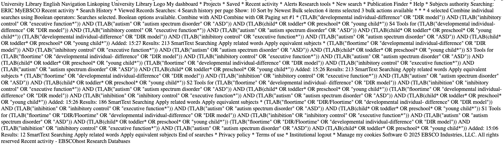
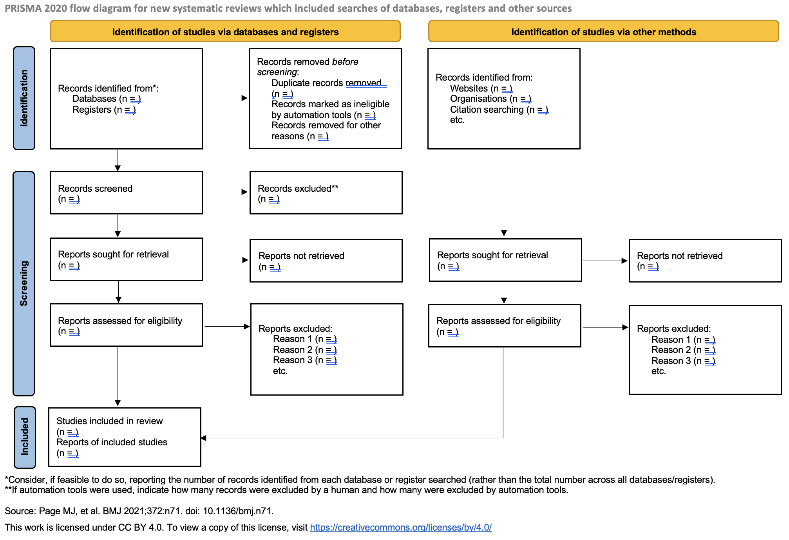

Tips shared in this post are mostly aimed at making database searches more streamlined and reproducible. This post builds on the information in the Beginner's guide to open and reproducible systematic reviews ([Carlsson et al., 2024](https://doi.org/10.1525/collabra.126218)). If you're not familiar with the systematic search methodology, start with the resources in @sec-introduction at the end of this post.

A short checklist for a reproducible search strategy:

- [ ] Define a research question according to a selected framework (e.g., PICOS)
- [ ] Build search blocks
- [ ] Select at least one technical database (e.g., ERIC) and one generic (e.g., OpenAlex)
- [ ] Pilot searches
- [ ] Report detailed final search strategy summaries
- [ ] Report individual database search strategies
- [ ] Share reference files

---

# Reporting the searches and search documentation
Reporting the conducted searches is extremely important for reproducibility and should be done as detailed as possible. Reproducible search strategies help during the review updates, helps with changes during peer-review, and ensures transparency of the process.

To properly report and present the searches, your supplements should contain the following:

1. Search terms 
2. Combined blocks
3. Date and Language limitations
4. Settings used for every database
5. Time when searches were conducted
6. Number of hits received
7. Raw datafile of exported searches (.ris, .bib)

To document the exported reference files in a reproducible way:

1. use a reference manager (e.g., [Zotero](https://www.zotero.org/), [Mendeley](https://www.mendeley.com/), [EndNote](https://endnote.com/))
2. Import files and name them in a legible way: database-name_date-of-search_number-of-articles
3. Each database search file should be its own directory/folder
4. Separate folder for search history documents

You can find many great examples of reported search strategies on a preprint platform that publishes systematic search strategies: [searchRxiv](https://www.cabidigitallibrary.org/doi/10.1079/searchRxiv.2025.01150). These searches can be reused, adapted, or used as inspiration for your search strategies.

# Example search strategy

Let's say you're interested in the *effects of cognitive training on inhibition in children on the autism spectrum*. You want to find all relevant studies and meta-analyze the effects. To build a reproducible, easy-to-follow search strategy, you can use excel (or other spreadsheet software of choice) to first discern the relevant categories and search terms. To do this, let's start with a hypothetical research question (RQ) following the PICOS framework:

> What is the effect of floortime (I) on inhibition control (O) in children with autism spectrum disorder (P)?

This research question contains the population, intervention, and outcome of interest. You can also define the comparison as "children with ASD which do not receive the intervention", and study design as "randomized-controlled trials". 

- [X] Define a research question according to a selected framework (e.g., PICOS)

A complete PICOS RQ would then be: *What is the effect of floortime (I) on inhibition control (O) in children with autism spectrum disorder (P), compared to no intervention (C), as evaluated in randomized controlled trials (S)*?

These can be part of the RQ, but can also be left out. Leaving out parts of the framework depends on your aims regarding precision/sensitivity. For example, adding terms relating to the study design could increase precision, but if the design is not mentioned in the relevant article field, you will miss potentially relevant articles.

- [X] Build search blocks
Once you have your RQ, you can start writing down search terms that could be relevant to each category. See the first tab below for an example of how to write it.

```{r}
#| label: setup
#| echo: false
#| message: false
# Load packages and read the Excel once
library(readxl)
library(knitr)

excel_file <- "../searches/demo_searches.xlsx"

picos_tbl  <- read_excel(excel_file, sheet = "keywords")
db_tbl     <- read_excel(excel_file, sheet = "search terms")
final_tbl  <- read_excel(excel_file, sheet = "final search strategies")

pubmed_demo <- read.csv("../searches/PubMed-demo.csv")

ebsco_csv <- read.csv("../searches/ebsco_csv.csv")
ebsco_html <- "../searches/ebsco_html.html"

```

::: {.panel-tabset}

## PICOS keywords

```{r}
#| echo: false
#| lst-label: lst-keywords
#| lst-cap: PICOS keywords
knitr::kable(picos_tbl)

```

## database blocks

```{r}
#| echo: false
knitr::kable(db_tbl)
```

## final search strategies

```{r}
#| echo: false
knitr::kable(final_tbl)

```

## PubMed demo search history
```{r}
#| echo: false
knitr::kable(pubmed_demo)

```

:::

- [X] Select at least one topic-relevant (e.g., PUBMED or ERIC) and one interdisciplinary database (e.g., SCOPUS or OpenAlex)
- [X] Pilot the searches

Although you should read relevant articles and systematic reviews to identify correct terms for your search, you can also use AI to help you find relevant terms. Once you're happy with the terms, you should select relevant databases to start building and piloting the searches. AI tools can help you translate the search strategies for different databases, but I don't recommend completely relying on AI for this step. You should always learn about the specific features of each database to avoid errors caused by incorrect combinations of operators and truncations. AI can do the manual work for you, but you must understand the structure of each search and be familiar with database-specific rules.

Librarians/information retrieval specialists can help deciding what a relevant database would be. For this example, I searched [SCOPUS](https://www.scopus.com/home), as it's a generic, commonly used databasethat contains a large number of sources from all scientific disciplines. SCOPUS is additionally hosted on its own, not available through an interface like ProQuest. I also searched [PUBMED](https://pubmed.ncbi.nlm.nih.gov/), which is a medical database. PUBMED is more specialized than SCOPUS, but it's relevant in this example with a clinical population, and a health-oriented intervention.

## Sharing your search strategy

- [X] Report detailed final search strategy summaries
- [X] Report individual database search strategies

How you access the database usually depends on what type of access you have. If you try to access a database (e.g., PsycINFO) through your university library login, you might be directed to a search interface (e.g., ProQuest or EBSCOHost). Different interfaces provide different ways to save your search history, and you should familiarize yourself with each of their features before conducting the searches. 

To share the searches, you can create a document (usually any text editor works) with a summary of all database searches on the first page (look at the **final search strategies** tab). On the following pages, paste individual, complete searches from each database (e.g., **PubMed demo search** tab). This document is useful for others to quickly understand and rerun your searches. It will also be useful to you when you update your searches, or need to troubleshoot them. To make sure you have reported all relevant information, follow the [PRISMA-S](https://www.prisma-statement.org/prisma-search) reporting guidelines for systematic searches.

For example, conducting searches through [ProQuest](https://support.proquest.com/s/article/How-to-Export-Recent-Searches?language=en_US) and, since recently, [EBSCOHost](https://connect.ebsco.com/s/article/Downloading-your-Search-History-in-the-New-EBSCO-User-Interfaces?language=en_US) allows you to download the Search History in multiple file formats. This is very convenient for sharing reproducible search strategies. However, for databases that do not provide downloadable search strategies, a workaround can be saving the website with all conducted searches as a text file. This is the quickest and the simplest way to have a complete search history in one file, although it would be less interoperable. To save the file this way, go to the search history section of the database, select "Save page as..." in your browser, and save as text file format. You can also copy-paste each search string manually into a file of your choice to capture all relevant information, which is more time consuming, but allows you flexibility in how you save the searches. 

The goal is to save your strategies locally on your machine, and there are multiple ways to achieve this, and these are some of the quickest/simplest ways to ensure you have the entire search history saved in one place.

You can see two examples of the saved search history^[You might see *history* and *strategy* used interchangeably. They usually refer to the same thing in slightly different contexts, and it's not really detrimental if you mix the terms. A search strategy basically contains the final search string and accompanying filters/delimiters for each database you plan to search. A search history is essentially that implemented search strategy, containing all of the search strings and selected limitations, and is taken from the database search history section.] from EBSCOHost.

::: {.panel-tabset}

## Downloaded from EBSCOHost

```{r}
#| echo: false
knitr::kable(ebsco_csv)

```

## Website saved as text



:::

This file can then be shared as a supplement on OSF or other repositories. If you instead decide to publish your search strategies on [searchRxiv](https://scholarworks.indianapolis.iu.edu/server/api/core/bitstreams/ea8d3e9b-490f-4187-bac9-5c0fdbf38869/content), you should follow their instructions.

## Sharing your reference files

- [X] Share reference files

Although sharing the search strategy is crucial, oftentimes, searches are not 100% reproducible. While databases index articles regularly, there is often a delay in cross-referencing the studies. This means that relevant studies can appear after you have already conducted your searches, and then they appear only when you rerun the search at a later time. Likewise, studies you found initially could be removed from the databases for various reasons. This is why it's important to save and share the original reference list you retrieved in your initial search. 

The easiest way to do this is to download the references when you conduct the searches and save them. You can import them and keep them in Zotero (which I mentioned as an open source alternative, but other reference managers work fine as well), or just keep them as a .bib or .ris file locally. This initial reference file is the most important to keep safe, as you can always reuse it if the next steps (i.e., screening or deduplication) go awry. In addition to sharing this file, you can also share the reference file of excluded and included references. 

a) If you screen in spreadsheets (e.g., Excel), you can tag the articles as "excluded" or "included" in [Zotero](https://www.zotero.org/support/collections_and_tags), filter the tagged articles, and export the reference file for each tag (I recommend as a .bib file, and a .csv file so you can more easily go through those references later).
b) if you use screening softwares (like [Rayyan](https://help.rayyan.ai/hc/en-us/articles/16758865054225-How-to-export-references-articles-in-Rayyan) or [Covidence](https://support.covidence.org/help/exporting-data)), they provide ways to export only excluded or included articles in multiple formats.

I recommend exporting either as .bib or .ris file. These are the most versatile file formats, easily imported to most reference managers, and compatible with R packages for systematic reviews and LaTeX.

---


# What is a "systematic" literature search? {#sec-introduction}

- [JBI Search Methodology](https://jbi-global-wiki.refined.site/space/MANUAL/355827873/2.4+Search+Methodology+for+JBI+Evidence+Syntheses)

- [Cochrane Handbook for Systematic Reviews](https://www.cochrane.org/authors/handbooks-and-manuals/handbook/current/chapter-04)

- [PRESS Guidelines for Search Strategies](https://doi.org/10.1016/j.jclinepi.2016.01.021)


::: {.callout-note collapse = true}

## Quick Intro to Systematic Searches

<!---
> "The search strategy for a scoping review should ideally aim to be as comprehensive as possible within the constraints of time and resources in order to identify both published and unpublished (gray or difficult to locate literature) primary sources of evidence, as well as reviews. Any limitations in terms of the breadth and comprehensiveness of the search strategy should be detailed and justified." - **JBI Manual for Evidence Synthesis**

The basis of systematic reviews entails a systematic search of the literature. Unlike other types of reviews, systematic reviews aim to find (hopefully) every article ever published on the topic of your interest. This type of searching minimizes the risk of bias caused by “cherry-picking results” and provides a fair picture of the state of the evidence. 

What good systematic reviews should do is have a broad, extensive, systematic search of literature and provide a reproducible and well documented search history of all databases as you'll as raw export of bibliography found with the searches.

The entire search process and selection of eligible studies is recorded in the PRISMA flow diagram and should clearly state the number of records at each step, as you'll as the exclusion criteria for the screened records.


-->

1. First (and the most important) step of the literature search involves conducting searches in citation databases (e.g., [ERIC](https://eric.ed.gov)), which are systematic, searchable collections of journals and their articles, along with other types of publication formats (e.g., book chapters or conference proceedings). These databases can be hosted on their own, or more often, they are available through database interfaces (e.g., [ProQuest](https://www.proquest.com/)). Therefore, one would conduct a search in ERIC through the ProQuest interface, and it is not completely informative to state that the search was conducted in ProQuest.

2. Second comes manual searching of selected journals to ensure main articles of interest are caught. This is needed because you may miss studies that do not have any of the keywords you used in your database searches. This should not really happen if your search strategies are thorough, but as the fields in social sciences have heterogeneous terminology, it is often difficult to capture all possible alternatives.

3. Third comes the *grey literature* - this covers theses and dissertations, non-scientific papers (e.g., news articles), pre-prints (non-peer-reviewed) on preprint servers (e.g., [PsyArXiv](https://www.psyarxiv.com/)), file drawer reports (i.e., never published studies), unpublished datasets, or any other type of relevant text which is not peer-reviewed and published in a scientific journal —> **this is an extremely important and often overlooked step!!** grey literature is found through websites that register trials (like [ClinicalTrials.gov](https://clinicaltrials.gov/)), preprint servers (found on the [OSF preprint platform](https://osf.io/preprints/discover)), preregistration websites (e.g., Prospero), gray literature databases (e.g., [BASE](https://www.base-search.net/?l=en)), and most commonly Google Scholar (which is not a reproducible search engine so be careful when reporting the searches)

4. Finally, you go through *forward* and/or *backward* reference searches - a forward search means you will search for all studies that have cited your included studies. Backward reference search means retrieving all references your included studies have cited. You can do this manually by screening the references within each article, but many databases allow for forward and backward searches of selected references. There are also websites that extract references of selected articles for you and collate them in one reference file for you (e.g., [CitationChaser](https://doi.org/10.1002/jrsm.1563))

# Forming a search strategy

1. Come up with the terminology and eligibility criteria (with a content expert)
2. (With information retrieval specialist/librarian assistance) form a search strategy specific to each database
3. Pilot the searches
4. Reiterate the first three steps until you reach a consensus on a satisfying search string

## Free text vs. controlled vocabulary

Searches can contain terms that can appear in the title, abstract, full text, keywords, and other parts of the articles, and this can include any word or combination of words. Other terms can be indexed subjects (thesaurus/MeSH terms) which are standardized and assigned to reports by specialized indexers. Some databases do not contain controlled vocabulary, but if a database does contain it, it is recommended that relevant terms are included in the search strategies. For example, if you look for studies on intellectual disability, a thesaurus term might be something like "intellectual developmental disorder", which should catch all relevant articles. 

However, this stage requires testing out all potentially relevant terms and evaluating the number of hits and their precision before deciding which terms will be part of the final search strategy. Often, *free-standing text* (i.e., non-thesaurus terms) seem to retrieve all relevant hits and cover the thesaurus terms, and are essential if the studies get lagged indexing with the thesaurus terms. This step requires expertise and trying out various approaches, and is usually subjective to a certain degree.

## Sensitivity vs. precision
|                     | Retrieved Reports               | Not Retrieved Reports              |
|---------------------|---------------------------------|-------------------------------------|
| Relevant Reports    | Relevant reports retrieved (a)  | Relevant reports not retrieved (b)  |
| Irrelevant Reports  | Irrelevant reports retrieved (c)| Irrelevant reports not retrieved (d)|

**Sensitivity**: how many relevant reports were located out of all existing relevant reports (a/(a+b)) —> e.g., there are 35 articles that exist and fit your criteria and your search strategy retrieved 33 of these studies.

**Precision**:  how many reports are relevant from all the reports your search strategy retrieved (a/(a+c)) —> e.g., your search strategy retrieved 500 reports, and 33 of those are relevant.

Defining search strings is a complex task, and this step takes time and piloting. Often is best to get help from a *librarian/information retrieval specialist* during this stage to help find the best search strings for each database. It is also important to have *someone who’s familiar with the research field* and knows common terminology during search strategy creation. Sometimes, the offered thesaurus terms don’t fit your scope, or offer more hits than you find necessary which makes the searches less precise. Librarians know how to devise searches in different databases, and often have access to better search tools. However, these tips can help you create a search strategy on your own. An important part in creating a search string is balancing between having a very sensitive search strategy (*locates all possible* hits that fit your criteria but also covers irrelevant hits) and a precise search (*only returns relevant* hits but with the possibility of not finding all of the relevant ones). 

Deciding between sensitivity and precision is also a subjective decision. After trialing the searches, it is important to consider how many articles you retrieved, how relevant they are (by piloting/skimming through the most relevant hits) and evaluating this information against the capacity of the team doing the systematic review. For example, if there are enough resources and time to screen all records, allowing stronger sensitivity may be a better option. This decision also depends on the type of review you're conducting -- if you are doing a rapid review, precision will be your main concern, but for a scoping review, you'll aim for sensitivity.


| PICOS        | Search strings                                                                 | Operators | Additional limits                      |
|--------------|--------------------------------------------------------------------------------|-----------|-----------------------------------------|
| Demographic  | (adult* OR "over 18")                                                          | AND       | Language: English                       |
| Diagnosis    | "Intellectual disabilit\*" OR "intellectual developmental disorder\*"            | AND       | Publication date: 2005-2022             |
| Intervention | "Working memory tasks" OR "short-term memory intervention*"                    | AND       |                                         |
| Outcome      | "Working memory"                                                               |           |                                         |


The simplest way to build a search strategy is to divide the keywords according to the frameworks for the research question (e.g., PICOS for systematic reviews or PCC for scoping reviews). Like in the example table above, keywords can be categorized under the population concepts (i.e., demographic or diagnosis), intervention concept, comparison/control, outcome, or study design concepts.

Once the keywords are categorized, you can start looking for synonyms, alternative spellings, relevant terminology that describes the concepts, and depending on the database, thesaurus terms. 

## Other limitations
You can limit your searches to improve precision by restricting type of document formats, limiting the publication dates and language of the publications. If not justified by theory or other sensible reasons, you should put as few limitations to searches as possible (e.g., if a certain intervention was invented in 2005, it is sensible to limit publication date to that period).

## Search operators

Operators are symbols or words used to connect keywords to build a search that a database can properly understand and execute. Operators allow us to manipulate precision and sensitivity of our search strategies. 

Example of operators in the [EBSCOHost](https://www.ebsco.com/) search engine:

| AND                                                                 | OR                                                                                      | NOT                                                                                           |
|----------------------------------------------------------------------|-----------------------------------------------------------------------------------------|-----------------------------------------------------------------------------------------------|
| Each result contains all search terms.                              | Each result contains at least one search term.                                          | Results do not contain the specified terms.                                                   |
| The search "child AND autism" finds items that contain both "child" and "autism". | The search "child OR minor" finds items that contain either "child" or items that contain "minor". | The search "autism NOT Asperger" finds items that contain "autism" but do not contain "Asperger".   |

Databases also use parentheses “()” to form search chunks that should go together, for example "(Child* OR minor) AND (autism OR Asperger\*)". Quotation marks are used to form phrases which will be searched verbatim, and not separately in text, e.g., “Down syndrome”. Asterisk (\*) is used to truncate words, i.e., find all versions of a particular word. For example, "teach\*" will retrieve "teach", "teacher", "teaching", "teaches".

:::